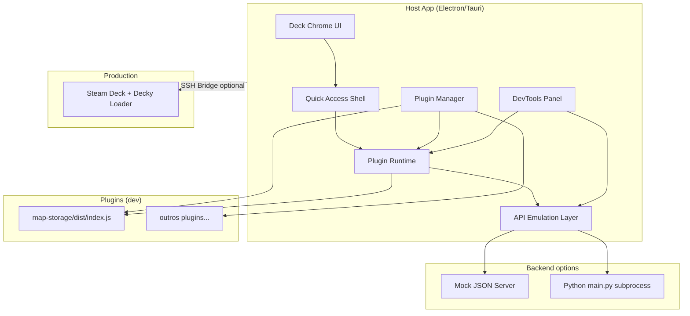
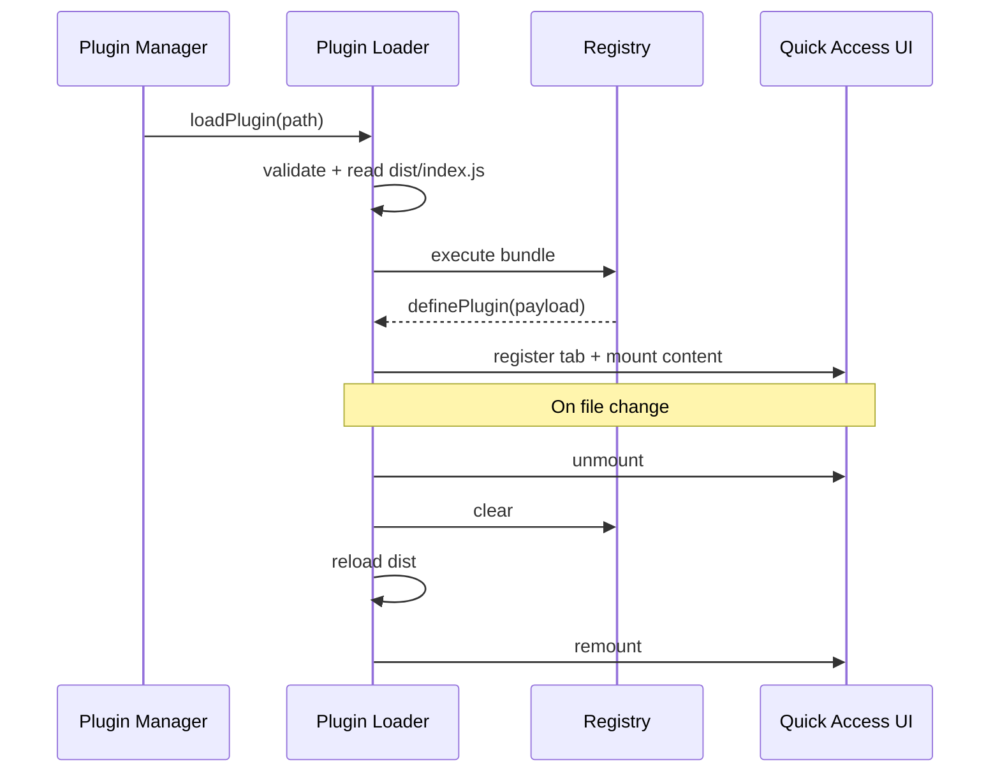
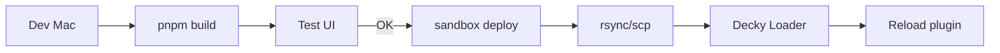

# Arquitetura — Decky Dev Sandbox

## 1. Visão de componentes



---

## 2. Camadas e responsabilidades

### 2.1 Presentation Layer (`packages/sandbox-ui`)

| Componente | Responsabilidade |
|------------|------------------|
| `DeckFrame` | Viewport 16:10, safe areas, escala DPI |
| `QuickAccessPanel` | Lista de plugins, seleção ativa, animação entrada/saída |
| `GamepadFocusManager` | Navegação por foco (tab order estilo controle) |
| `DevToolsDrawer` | Logs, erros React, chamadas `callable` |

**Dependências:** React, CSS variables, opcionalmente `@decky/ui` para o chrome (não confundir com árvore do plugin).

### 2.2 Plugin Runtime (`packages/plugin-loader`)

Responsável por:

1. Ler `plugin.json` e validar schema mínimo.
2. Carregar `dist/index.js` (formato gerado por `@decky/rollup`).
3. Fornecer globals esperados (`window.SP_REACT`, etc., conforme versão do ecossistema — **validar no spike** contra bundle atual do template).
4. Interceptar `definePlugin` e registrar entrada no registry.
5. Montar `content` do plugin em um portal React dentro do Quick Access.
6. Desmontar e limpar listeners no reload.



### 2.3 API Emulation Layer (`packages/sandbox-api`)

Implementa o contrato de `@decky/api` para o host:

| Export | Implementação sandbox |
|--------|------------------------|
| `definePlugin` | Registra no `PluginRegistry` |
| `callable(name)` | Retorna função async → `RpcClient.invoke(name, args)` |
| `toaster` | Delega para `ToastService` do host |
| `addEventListener` / `removeEventListener` | `SandboxEventBus` |
| `routerHook` (futuro) | No-op com warning L2 |

**RpcClient** roteamento:

```
callable("add", [1, 2])
    → BackendAdapter
        ├─ mode=mock → fixtures/add.json
        ├─ mode=python → stdin/stdout ou socket com main.py
        └─ mode=remote → WebSocket para Deck (v2)
```

### 2.4 Plugin Manager

- **Diretório padrão:** `~/.decky-sandbox/plugins/`
- **Modo dev:** symlink de `/Users/.../map-storage` sem cópia.
- **Operações:** `install(path)`, `enable`, `disable`, `uninstall`, `list`.
- **Validação:** delega a `plugin-validator`.

### 2.5 Backend Adapters

#### Mock adapter

Arquivo `sandbox.backend.json` na raiz do plugin:

```json
{
  "add": { "returns": 3 },
  "start_timer": { "returns": null, "emits": [{ "event": "timer_event", "delay_ms": 1000 }] }
}
```

#### Python adapter

- Spawn: `python3 main.py` com protocolo definido (recomendação: JSON lines ou reutilizar protocolo Decky se documentado).
- Timeout padrão: 30 s por chamada.
- cwd: raiz do plugin.

#### Remote adapter (v2)

- Túnel para `main.py` no Deck via SSH; apenas para testes integrados pontuais.

---

## 3. Estratégia de bundling e globals

O template Decky externaliza React e dependências via Rollup. O sandbox deve:

1. **Inspecionar** `dist/index.js` do template atual para listar `externals` e globals.
2. **Expor no `window`** as mesmas chaves que o Loader usa na versão alvo do Decky.
3. **Versionar** tabela de globals por faixa de versão `@decky/rollup` (ex.: rollup 1.x).

| Global (exemplo — confirmar no spike) | Fornecido por |
|---------------------------------------|---------------|
| React / ReactDOM | Host singleton |
| `@decky/ui` | Alias para bundle do host |
| `@decky/api` | Alias para `sandbox-api` |

**Risco:** mismatch de versão React 19 plugin vs host → documentar alinhamento de `peerDependencies`.

---

## 4. Persistência

```
~/.decky-sandbox/
├── config.json           # resolução, tema, backend mode
├── plugins/
│   └── <plugin-id>/
│       └── meta.json     # enabled, source path
├── settings/
│   └── <plugin-id>.json  # settings API futura
└── logs/
    └── session-<ts>.log
```

---

## 5. CLI (`decky-sandbox`)

| Comando | Ação |
|---------|------|
| `sandbox init` | Cria config local |
| `sandbox dev <path>` | Abre host + watch plugin (`pnpm watch` opcional) |
| `sandbox validate <path>` | Checa estrutura plugin store |
| `sandbox deploy <path> --host deck@ip` | rsync + instruções reload (v1) |

---

## 6. Isolamento de execução

**Opção A (MVP):** mesmo contexto React com try/catch no boundary — simples, menos seguro.

**Opção B (recomendado v1):** iframe `sandbox` attribute + postMessage para RPC.

**Opção C (v2):** Worker para lógica JS puro; UI apenas via mensagens.

Decisão MVP: **A** com Error Boundary; migrar para **B** antes de suportar plugins de terceiros não confiáveis.

---

## 7. Integração CI

```yaml
# Exemplo conceitual
- run: pnpm run build          # no plugin
- run: sandbox validate .
- run: sandbox test-smoke .    # headless: mount + screenshot
```

Pacote `plugin-validator` reutilizável em CI de plugins (npm publish opcional).

---

## 8. Bridge macOS → Steam Deck



Paths típicos no Deck (confirmar versão Loader):

- `/home/deck/homebrew/settings/decky/plugins/<plugin-name>/`

---

## 9. Dependências entre pacotes

```
desktop app
  → sandbox-ui
  → plugin-loader
  → sandbox-api
  → plugin-validator

plugin-loader
  → sandbox-api

sandbox-ui
  → (opcional) @decky/ui
```

---

## 10. Decisões arquiteturais (ADRs resumidas)

| ID | Decisão | Alternativa rejeitada | Motivo |
|----|---------|----------------------|--------|
| ADR-001 | Monorepo pnpm | Multi-repo | Plugins + host evoluem juntos no MVP |
| ADR-002 | Shim `@decky/api` separado | Monkey-patch no bundle | Testabilidade e CI |
| ADR-003 | Não embarcar Loader real | Fork decky-loader | Complexidade SteamOS |
| ADR-004 | Tauri/Electron | Apenas web | Precisa FS + subprocess |
| ADR-005 | Compat em camadas L0–L3 | “100% compat” | Expectativa realista |

---

*Ver também: [plano-completo.md](./plano-completo.md), [compatibilidade-decky.md](./compatibilidade-decky.md)*
