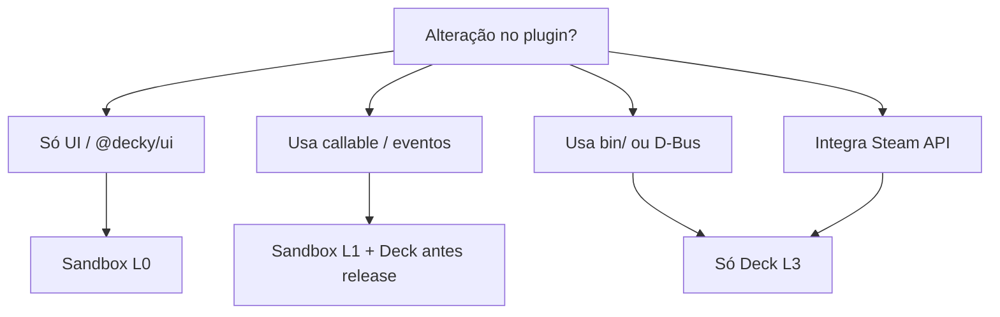

# Compatibilidade com Decky Loader

Este documento define o que o **Decky Dev Sandbox** pode reproduzir com fidelidade e o que **exige validação no Steam Deck**.

---

## 1. Modelo de níveis (L0–L3)

| Nível | Nome | Comportamento | Ação do desenvolvedor |
|-------|------|---------------|------------------------|
| **L0** | Paridade | Mesma API e UX esperada | Nenhuma |
| **L1** | Simplificado | API existe; backend/mock diferente | Testar callable no Deck antes de release |
| **L2** | Stub | API existe; retorna vazio ou warning | Consultar docs; evitar em produção |
| **L3** | Não suportado | Requer SteamOS / Loader / binários | Validar só no hardware |

---

## 2. `@decky/api`

| API | Nível | Sandbox | Deck real | Notas |
|-----|-------|---------|-----------|-------|
| `definePlugin` | L0 | Registry local | Loader registry | Core do MVP |
| `callable` | L1 | Mock JSON / Python local | RPC → `main.py` | Protocolo Python pode diferir sutilmente |
| `toaster` | L0 | Toast host | Toast Steam UI | Estilo pode variar |
| `addEventListener` | L0/L1 | EventBus local | Eventos Loader/Python | Timers mock vs asyncio real |
| `removeEventListener` | L0 | Sim | Sim | |
| `routerHook` | L2 | Warning + no-op | Hooks Steam router | Pesquisar para v2 |
| Settings API (futuro) | L1 | JSON em `~/.decky-sandbox` | Persistência Decky | |

---

## 3. `@decky/ui` (componentes)

Prioridade baseada no [decky-plugin-template](https://github.com/SteamDeckHomebrew/decky-plugin-template) e uso comum.

| Componente / export | Nível | MVP | Beta | Notas |
|---------------------|-------|-----|------|-------|
| `PanelSection` | L0 | ✓ | ✓ | |
| `PanelSectionRow` | L0 | ✓ | ✓ | |
| `ButtonItem` | L0 | ✓ | ✓ | |
| `staticClasses` | L0 | ✓ | ✓ | CSS do host deve incluir classes Steam-like |
| `ToggleField` | L0 | | ✓ | |
| `SliderField` | L1 | | ✓ | Gamepad focus importante |
| `Dropdown` | L1 | | ✓ | |
| `Dialog` | L1 | | ✓ | Modal stack |
| `Tabs` | L1 | | ✓ | |
| `Navigation` | L2 | | ✓ | Depende de rotas Steam |
| `ProgressBar` | L0 | | ✓ | |
| `Spinner` | L0 | | ✓ | |
| `Scroll` | L1 | | ✓ | Touchpad/gamepad scroll |

**Estratégia:** usar `@decky/ui` real no host (mesma versão do plugin quando possível).

---

## 4. Backend Python (`main.py`)

| Recurso | Nível | Sandbox | Deck |
|---------|-------|---------|------|
| Funções expostas via `callable` | L1 | Subprocess + protocolo sandbox | Decky serverAPI |
| `asyncio` / timers | L1 | setTimeout / mock emits | Comportamento real |
| Acesso filesystem Steam | L3 | Não | Sim |
| `decky` module APIs | L2/L3 | Stubs parciais | Completo |
| Plugins com `bin/` nativo | L3 | Não executar no Mac | Linux ELF |

### Protocolo Python recomendado (sandbox)

Para L1 estável, definir contrato mínimo documentado:

```
stdin:  {"method":"add","args":[1,2],"id":1}
stdout: {"id":1,"result":3}
```

Alternativa: reutilizar wire format do Decky se estável e documentado na wiki.

---

## 5. Estrutura de plugin (distribuição)

Alinhado ao template oficial:

| Arquivo / pasta | Obrigatório | Sandbox | Deck |
|-----------------|-------------|---------|------|
| `plugin.json` | Sim | Valida | Sim |
| `package.json` | Sim | Valida | Sim |
| `dist/index.js` | Sim | Carrega | Carrega |
| `main.py` | Se usar Python | Opcional local | Sim |
| `bin/` | Opcional | L3 — ignorar com aviso | Sim |
| `LICENSE` | Store | N/A dev | Sim |
| `README.md` | Recomendado | N/A | Sim |

---

## 6. Globals e bundling (Rollup)

**Ação obrigatória na Fase 0:** preencher tabela abaixo após spike com `map-storage/dist/index.js`.

| Global / external | Fornecido por host | Versão alinhada | Status |
|-------------------|-------------------|-----------------|--------|
| `react` | Host React | 19.x | ⬜ Confirmar |
| `react-dom` | Host ReactDOM | 19.x | ⬜ Confirmar |
| `@decky/ui` | Host bundle | 4.x | ⬜ Confirmar |
| `@decky/api` | `sandbox-api` | 1.x | ⬜ Confirmar |

Mismatch de versão React → sintoma: hooks inválidos ou UI em branco.

---

## 7. Decky Loader vs Sandbox

| Capacidade Loader | Sandbox v1 | Sandbox v2 |
|-------------------|------------|------------|
| Instalar zip por URL | Não | Marketplace local opcional |
| Atualizar plugin OTA | Não | Não |
| Integração menu Steam | Não | `routerHook` L2 |
| Quick Access real | Simulado | Simulado |
| Logs sistema Decky | Parcial (DevTools) | Bridge remoto |
| Permissões / sandbox OS | SteamOS | Desktop isolado |

---

## 8. Matriz de decisão: onde testar?



---

## 9. Plugins de referência para teste

| Plugin / fixture | Tipo | Objetivo |
|------------------|------|----------|
| `map-storage` (este repo) | Template + Python | Baseline desenvolvimento |
| decky-plugin-template upstream | Oficial | Regressão compat |
| Plugin UI-only comunidade | Terceiro | Validar L0 amplo |
| Plugin com `bin/` | Terceiro | Confirmar aviso L3 |

---

## 10. Atualização desta matriz

- **Responsável:** mantenedor do sandbox.
- **Gatilho:** release nova `@decky/api` ou `@decky/ui`.
- **Processo:** rodar suite smoke + atualizar colunas MVP/Beta.

---

*Ver [plano-completo.md](./plano-completo.md) §7 e [arquitetura.md](./arquitetura.md) §2.3.*
