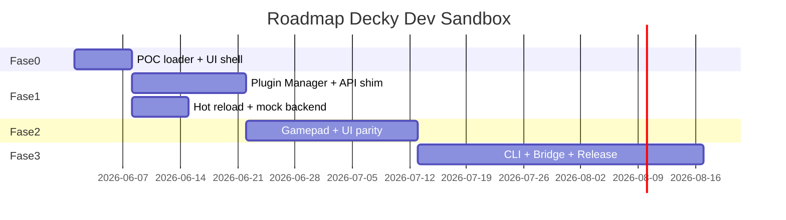

# Roadmap — Decky Dev Sandbox

Cronograma em **semanas de calendário** (1 dev em tempo parcial). Ajuste conforme dedicação full-time (reduzir ~40%).

---

## Visão geral

| Fase | Duração | Entregável principal |
|------|---------|----------------------|
| 0 — Fundação | 1 sem | POC: plugin template renderiza no host |
| 1 — MVP | 2–3 sem | Dev diário sem Deck para UI + mock callable |
| 2 — Beta | 3–4 sem | Gamepad, mais componentes, docs comunidade |
| 3 — v1.0 | 4–6 sem | CLI, bridge SSH, releases, E2E |
| 4 — v2 | contínuo | VM profile, CI headless, marketplace local |

---

## Fase 0 — Fundação (Semana 1)

### Objetivos

- Validar viabilidade técnica do carregamento de `dist/index.js`.
- Definir tabela de globals Rollup/Decky para a versão atual do template.

### Tarefas

| # | Tarefa | Saída |
|---|--------|-------|
| 0.1 | Criar monorepo `decky-dev-sandbox` (pnpm workspaces) | Repo inicial |
| 0.2 | App Vite + React mínimo em `apps/desktop` | Janela vazia 1280×800 |
| 0.3 | Spike: importar `map-storage/dist/index.js` | Tela com conteúdo ou erro documentado |
| 0.4 | Mapear externals do Rollup (`@decky/rollup` config) | `docs/globals-matrix.md` (ou seção em compatibilidade) |
| 0.5 | Protótipo `definePlugin` registry | Um plugin na lista lateral |

### Critério de saída

- Template oficial exibe pelo menos um `PanelSection` no host.
- Documento de globals publicado internamente.

### Riscos da fase

- Globals incompatíveis → bloquear e ajustar antes da Fase 1.

---

## Fase 1 — MVP (Semanas 2–4)

### Objetivos

- Desenvolvedor usa apenas Mac para iterar UI do plugin.
- `callable` funciona via mock ou Python local.

### Tarefas

| # | Tarefa | Prioridade |
|---|--------|------------|
| 1.1 | Pacote `sandbox-api` com `definePlugin`, `callable`, `toaster`, eventos | P0 |
| 1.2 | Pacote `plugin-loader` com mount/unmount | P0 |
| 1.3 | Plugin Manager: symlink pasta dev | P0 |
| 1.4 | File watcher em `dist/index.js` → hot reload | P0 |
| 1.5 | CLI `sandbox dev <path>` | P0 |
| 1.6 | Mock backend JSON | P1 |
| 1.7 | Python subprocess adapter para `main.py` | P1 |
| 1.8 | DevTools: console + stack trace | P1 |
| 1.9 | Error Boundary em torno do plugin | P0 |
| 1.10 | README quickstart + link para docs/ | P1 |

### Critério de saída

- Fluxo: editar `src/index.tsx` → watch build → UI atualiza.
- Plugin template: botão `add` retorna número.
- `start_timer` dispara evento simulado em ≤ 2 s (mock).

### Não fazer nesta fase

- Gamepad completo, bridge SSH, loja de plugins.

---

## Fase 2 — Beta (Semanas 5–8)

### Objetivos

- Melhorar fidelidade UX e cobertura de componentes.
- Onboarding de 2–3 devs externos para feedback.

### Tarefas

| # | Tarefa | Prioridade |
|---|--------|------------|
| 2.1 | `GamepadFocusManager` (setas + A/B) | P0 |
| 2.2 | Perfis de resolução (1280×800, 1920×1200) | P1 |
| 2.3 | Testar matriz de componentes `@decky/ui` usados em plugins populares | P0 |
| 2.4 | `plugin-validator` (estrutura plugin store) | P1 |
| 2.5 | Fixture `map-storage` + 2 plugins UI-only da comunidade | P1 |
| 2.6 | Página “Compatibility” gerada da matriz L0–L3 | P1 |
| 2.7 | Melhorar tema Quick Access (CSS) | P2 |
| 2.8 | Settings persistidos por plugin (JSON) | P2 |

### Critério de saída

- ≥ 3 plugins de terceiros rodam com adaptação documentada ≤ 5 linhas ou zero.
- Feedback de 3 devs incorporado em backlog v1.

---

## Fase 3 — v1.0 (Semanas 9–14)

### Objetivos

- Produto utilizável por comunidade; caminho claro Mac → Deck.

### Tarefas

| # | Tarefa | Prioridade |
|---|--------|------------|
| 3.1 | Empacotamento Electron ou Tauri (macOS + Linux) | P0 |
| 3.2 | `sandbox deploy` via SSH/rsync | P0 |
| 3.3 | `sandbox validate` alinhado ao [plugin store layout](https://github.com/SteamDeckHomebrew/decky-plugin-template) | P0 |
| 3.4 | E2E Playwright: 3 cenários smoke | P1 |
| 3.5 | Site/docs públicos (GitHub Pages) | P2 |
| 3.6 | Política de versionamento semver + changelog | P1 |
| 3.7 | Isolamento iframe (ADR segurança) | P1 |

### Critério de saída

- Release v1.0.0 com binários macOS e Linux.
- Tutorial em vídeo ou GIF de 2 min no README.
- Bridge testado em 1 Steam Deck físico.

---

## Fase 4 — v2 (backlog contínuo)

| Item | Descrição |
|------|-----------|
| VM profile | Script UTM/QEMU com SteamOS-like (experimental) |
| CI headless | `sandbox test-smoke` em GitHub Actions |
| Remote callable | Túnel para `main.py` no Deck |
| `routerHook` | Pesquisa + stub ou integração limitada |
| Plugin marketplace local | Pasta de zips para teste de instalação |
| Extensões | Temas, scripts de pré-build |

---

## Marcos e releases

| Versão | Marco | Conteúdo |
|--------|-------|----------|
| `0.1.0` | Fim Fase 0 | POC interno |
| `0.5.0` | Fim Fase 1 | MVP dev |
| `0.9.0` | Fim Fase 2 | Beta pública |
| `1.0.0` | Fim Fase 3 | Release estável |

---

## Dependências externas

| Dependência | Impacto no roadmap |
|-------------|-------------------|
| Mudanças em `@decky/rollup` | Revalidar globals (Fase 0 repetida parcial) |
| Novas APIs `@decky/api` | Atualizar `sandbox-api` |
| Documentação oficial Decky wiki | Alinhar bridge deploy paths |

---

## Estimativa de esforço (horas)

| Fase | Horas (estimativa) |
|------|-------------------|
| 0 | 20–30 |
| 1 | 60–80 |
| 2 | 80–100 |
| 3 | 100–140 |
| **Total até v1** | **260–350** |

---

## Priorização MoSCoW (v1)

| Must | Should | Could | Won't (v1) |
|------|--------|-------|------------|
| Load plugin dist | Gamepad | VM profile | Emular Steam library |
| API shim core | Validator | Themes | 100% API Steam |
| Hot reload | Deploy SSH | Marketplace | Fork Loader |
| Mock callable | E2E tests | | |

---

*Ver [mvp-checklist.md](./mvp-checklist.md) para tarefas executáveis da Fase 1.*
